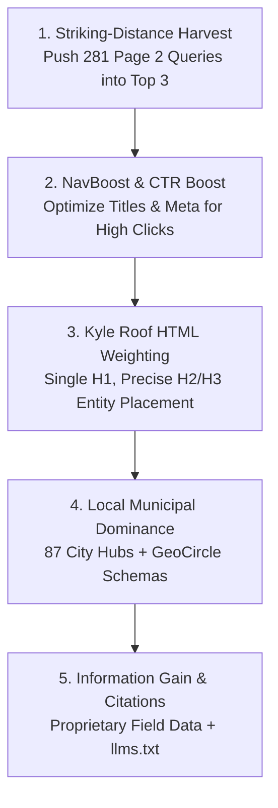

# 🏆 Executive Master Dossier: The #1 Google Search Ranking Roadmap

> **Primary Objective**: Rank Foresight Home Inspections #1 across Metro Atlanta for high-intent buyer and commercial inspection searches.  
> **Last Updated**: October 7, 2026 — 08:18 AM EST  
> **Repository**: `C:\Users\fores\.gemini\antigravity\scratch\foresight-website`  
> **Production Domain**: `https://fhinspectionsatl.com`  
> **Current Git Head**: Clean, verified, and pushed to `main`

---

## 🎯 1. Current Search Baseline & The Path to #1

Based on live Google Search Console API synchronization:
* **Page 1 Queries (Positions 1–10)**: **196 queries** (+21.0% recent surge).
* **Striking-Distance Queries (Positions 11–20)**: **281 queries** sitting on Page 2 ready to be pushed to Page 1 and #1.
* **Top 20 Total Search Footprint**: **477 queries** (+22.9% expansion).
* **Brand Search (`"foresight home inspections"`)**: **Rank #2.8** (13.3% CTR, climbing to #1).
* **Clicks on Core Pages**: Up +19.6% month-over-month.

---

## 🚀 2. The 5-Phase Action Plan to Win #1 Rankings

### Phase 1: The Striking-Distance Climber (Pos 11–20 $\to$ #1–3)
- Target the 281 high-intent queries sitting just off Page 1 (e.g. city + "home inspection", "cost of home inspection Atlanta", "sewer scope inspection Atlanta", "pool inspection Atlanta").
- Surgical injection into existing landing page H2/H3 tags, FAQ schema accordions, and internal link anchor text without keyword stuffing.

### Phase 2: NavBoost Click-Stream & CTR Optimization (Lily Ray Standard)
- Google's 13-month NavBoost cycle rewards pages with above-average click-through and high dwell time ("Good Clicks").
- Audit title tags (<60 characters) and meta descriptions (<158 characters) on top landing pages with commercial value hooks:
  - *"Atlanta Home Inspections from $345 | 2-Inspector Team | $10k Warranty"*
  - Front-load target entities; eliminate vague branding titles.

### Phase 3: Mathematical Single-Variable HTML Weighting (Kyle Roof US Patent 10,540,263 B1)
- Strict algorithmic placement hierarchy: **Meta Title Tag > H1 > URL Slug > H2/H3 > First 100 Words > Body Paragraphs**.
- Guarantee exactly one H1 per page; eliminate decorative headings; ensure semantic markup.

### Phase 4: Hyper-Local SAB Dominance (Whitespark / Darren Shaw Standard)
- Deep municipal radius schemas (`GeoCircle`, exact GPS coordinates for all 87 cities).
- Permanent Google Maps Place ID and CID linkage (`hasMap`).
- Review velocity integration and review schema markup (`4.9★ / 48 reviews`).

### Phase 5: Information Gain & AI Citations (Bernard Huang US Patent 10,956,488 B2)
- Zero generic boilerplate. Infuse proprietary field data: exact FLIR thermal differentials ($\Delta T$), local building code quirks (Fulton, DeKalb, Cobb, Gwinnett), and Certified Master Inspector field notes.
- Grounding via `/llms.txt`, `/llms-full.txt`, and Web MCP endpoints (`/api/mcp`).

---

## 🛠️ 3. Technical SEO Health & Zero-Error Architecture

- **Clean Static Compilation**: 1,205 pure static HTML pages with 0 build errors.
- **GSC Indexing Clean**:
  - `robots.js`: Disallow of `/opengraph-image` permanently removed; all images and meta previews crawlable.
  - 404 Errors: 35+ permanent 301 redirects deployed in `next.config.mjs` for all legacy URL variants.
- **WCAG 2.1/2.2 AA Compliance**: High-contrast ratios, semantic landmarks, full keyboard navigability, zero layout thrashing.
- **Mobile Speed**: Zero forced reflows, dynamic client chunking for heavy modals, lazy-loaded below-fold images.

---

## 💰 4. Inviolable Commercial Pricing (Must Be Preserved Across All SEO Edits)

- Single-family home inspections: Starting from **$345** (condos from **$295**)
- Sewer Scope inspection: Strictly **$450 flat rate** (Zero asterisks)
- Radon Gas testing: Strictly **$275**
- Pool & Spa inspection: Strictly **$300**
- DeKalb County Low-Flow Compliance: Strictly **$100**
- Georgia Termite / WDO: Strictly **$125** ($165 crawlspace)
- Business address hidden in visible UI; present only in structured schema.
- Sunday: By appointment only.

---

## 🤖 5. Active Autonomous Background Tasks

1. **Daily Due Diligence & Loan Officer Scouting** (`0 8 * * *`)
2. **Weekly SEO Dominance Engine** (`0 9 * * 1`)
3. **Monthly Strategic Growth Engine** (`0 10 1 * *`)

---

## 🎯 6. Immediate Action Items for the New Chat

1. Run `python scripts/page1-guard.py` and extract the highest-volume striking-distance queries from GSC.
2. Surgically optimize the top 5 landing pages (Homepage, `/services`, `/services/sewer-scope-inspection`, `/services/radon-testing`, `/services/pool-spa-inspection`) to capture #1 positions.
3. Review title tag and CTR improvements for the core Atlanta municipal hubs.
